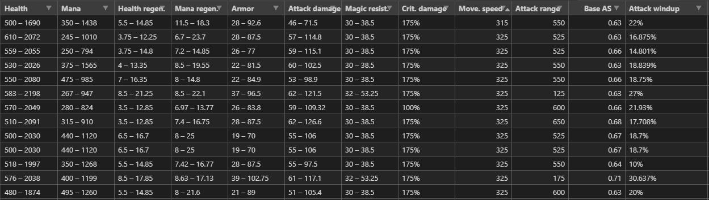

## AiCore Project (League of legends decision making)
This is my repository for my AiCore project based on the game League of Legends. The purpose of the project is to help create a model that helps you make better decisions in game. 

# Currentelly I have webscraped data for league of legends which includes:

1. Getting url links for probuild webpages
2. Gather champion winrates and pickrates
3. Gathering information on individual champion ingame stats

# Prerequisites:

To only prerequisites that are required are for the installation of pandas via (pip install pandas) and the installation of selenium. Please refer to the selenium documentation https://selenium-python.readthedocs.io/installation.html.

# Usage: 

Pull the gtihub repository from the documentation and with the prerequisites installed correctely just run the Python files in your desired intepreter and it will run and scrape accordingly. 

Note that for leaderboards_webscrape.py the xpaths for the variables might change if the ranks get updated. To fix this go to the leaderboards at https://euw.op.gg/ranking/ladder/ and update the xpaths for the links to the urls of the pro players. 

# How to view data:

The simplest way is by cloning the repository into vscode and viewing the data via the Excel Viewer Extension.

# Example data from scrape

As you can see from the data there are alot of values that are in string form and not float values. The will require some data cleaing to get the data into float values.

To see the next stage of the project (cleaning data and fitting it to a lenear regression model) you can follow this link https://github.com/CyExpert97/Project_1.5
