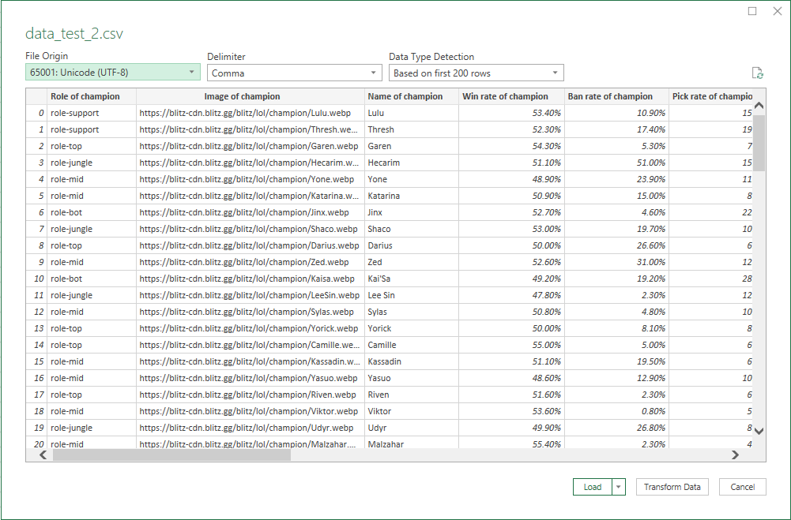

# AiCore Project (League of legends decision making)
This is my repository for my AiCore project based on the game League of Legends. The purpose of the project is to help create a model that helps you make better decisions in game. 

Currentelly I have webscraped data for league of legends which includes:

1. Getting url links for probuild webpages
2. Gather champion winrates and pickrates
3. Gathering information on individual champion ingame stats

Prerequisites:

To only prerequisites that are required are for the installation of pandas via (pip install pandas) and the installation of selenium. Please refer to the selenium documentation https://selenium-python.readthedocs.io/installation.html.

How to use: 

Pull the gtihub repository from the documentation and with the prerequisites installed correctely just run the Python files in your desired intepreter and it will run and scrape accordingly. 

Note that for leaderboards_webscrape.py the xpaths for the variables might change if the ranks get updated. To fix this go to the leaderboards at https://euw.op.gg/ranking/ladder/ and update the xpaths for the links to the urls of the pro players. 

How to view data:

To make sure that you collected all your data you can view your results in excel. To do this follow the steps below:

1. Open up a blank workbook in Excel
2. Navigate up to data and click on "From Text/CSV"
3. Navigate to the directory of "data_test_2.csv" or "top_100.csv"
4. When you import it make sure to change the file origin to "Unicode (UTF-8)" as shown below

If done successfully you should have the data imported into Excel. 
